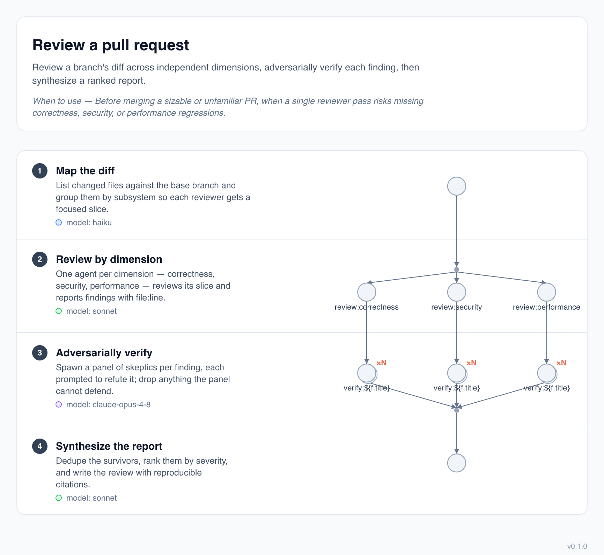

# claude-workflows-viz

Render a Claude Code **dynamic workflow** `.js` file's static structure into a clean diagram — SVG primary, PNG rasterized from it.



Dynamic workflows are JavaScript files that begin with `export const meta = { name, description, phases }` and then orchestrate subagents in the body. `claude-workflows-viz` reads the declarative `meta` block **and statically analyzes the imperative body — without ever executing the workflow** — then draws it as a **swimlane table** — one rounded white card (matching the header above it), split into a hairline-separated row per phase, with the phase label (chip, title, detail, and a quiet muted `model:` line) in a left cell and that phase's slice of the agent graph in the right cell. The graph itself is **one continuous flow top-to-bottom** — fan-outs into a barrier, pipeline stages, decision diamonds, and loops summarized as local "↻ repeat" badges — and a cross-phase edge is just a short ordinary edge, because phases are rows beside the graph, not containers it has to break out of. Everything is read straight off the parsed AST as static data: no `eval`, no `vm`, no `import()`, and no headless browser.

> The `workflow` view is the default. `--view topology` renders the inferred graph only; `--view phases` renders the original meta-only phase cards (preserved byte-for-byte).

## Install

```sh
npm install -g claude-workflows-viz
```

Or run it without installing:

```sh
npx claude-workflows-viz <workflow.js>
```

## Usage

```
claude-workflows-viz <workflow.js> [-o <out>] [--format svg|png|html|json] [--view workflow|topology|phases] [--scale <n>] [--open]
```

| Option | Description |
| --- | --- |
| `-o, --out <file>` | Write the diagram to this path. Omit it and SVG/HTML/JSON stream to **stdout**. |
| `--format <fmt>` | `svg` (default), `png`, `html`, or `json`. Inferred from `--out`'s extension when omitted. |
| `--view <view>` | `workflow` (default) draws phase context beside the agent graph; `topology` renders the inferred graph only; `phases` renders the meta-only cards. |
| `--scale <n>` | PNG rasterization scale, `0 < n ≤ 10` (default `2`). Higher is sharper and larger; lower is smaller. PNG only — SVG/HTML are vector. |
| `--open` | Open the rendered output in your default app after writing. |
| `-v, --version` | Print the version. |

### Examples

Point it at your own workflow file:

```sh
# SVG to stdout (composable)
claude-workflows-viz your-workflow.js > diagram.svg

# SVG to a file
claude-workflows-viz your-workflow.js -o diagram.svg

# PNG — format inferred from the .png extension
claude-workflows-viz your-workflow.js -o diagram.png

# Render a PNG and open it immediately
claude-workflows-viz your-workflow.js --format png --open
```

A sample workflow ships with the package. From a clone of this repo:

```sh
claude-workflows-viz examples/level-1/review-pr.js --open
```

After a global install, reference it where npm placed it:

```sh
claude-workflows-viz "$(npm root -g)/claude-workflows-viz/examples/level-1/review-pr.js" --open
```

Each phase badge is colored by its `model`: opus, sonnet, and haiku each get a swatch — matched even inside a full id like `claude-opus-4-8` — and any other model falls back to a neutral badge. Agent circles inside the graph are colored the same way.

## Example gallery

The twelve bundled workflows cover all six patterns from Anthropic's [*A harness for every task*](https://claude.com/blog/a-harness-for-every-task-dynamic-workflows-in-claude-code) post — and six more; each links to its committed renders.

| Workflow | Pattern | Render |
| --- | --- | --- |
| [`review-pr.js`](examples/level-1/review-pr.js) | review pipeline — staged lanes, no inter-stage barrier (the hero above) | [SVG](examples/level-1/review-pr.svg) · [PNG](examples/level-1/review-pr.png) |
| [`triage-issue.js`](examples/level-1/triage-issue.js) | classify-and-act — a decision routes to one of several specialists | [SVG](examples/level-1/triage-issue.svg) · [PNG](examples/level-1/triage-issue.png) |
| [`summarize-codebase.js`](examples/level-1/summarize-codebase.js) | fanout-and-synthesize — ×N readers, barrier, one synthesizer | [SVG](examples/level-1/summarize-codebase.svg) · [PNG](examples/level-1/summarize-codebase.png) |
| [`verify-fix.js`](examples/level-1/verify-fix.js) | adversarial verification — named skeptic lanes converge on a barrier | [SVG](examples/level-1/verify-fix.svg) · [PNG](examples/level-1/verify-fix.png) |
| [`name-the-feature.js`](examples/level-1/name-the-feature.js) | generate-and-filter — diverse generators, one filter | [SVG](examples/level-1/name-the-feature.svg) · [PNG](examples/level-1/name-the-feature.png) |
| [`choose-approach.js`](examples/level-1/choose-approach.js) | tournament — drafts, then a pairwise-judging loop until one stands | [SVG](examples/level-1/choose-approach.svg) · [PNG](examples/level-1/choose-approach.png) |
| [`hunt-bugs.js`](examples/level-1/hunt-bugs.js) | loop-until-done — keep spawning finders until rounds come up dry | [SVG](examples/level-1/hunt-bugs.svg) · [PNG](examples/level-1/hunt-bugs.png) |
| [`find-call-sites.js`](examples/level-1/find-call-sites.js) | multi-modal sweep — blind searchers fan out, then merge & dedupe | [SVG](examples/level-1/find-call-sites.svg) · [PNG](examples/level-1/find-call-sites.png) |
| [`draft-the-announcement.js`](examples/level-1/draft-the-announcement.js) | judge panel — independent drafts, then a rubric panel scores in parallel | [SVG](examples/level-1/draft-the-announcement.svg) · [PNG](examples/level-1/draft-the-announcement.png) |
| [`compile-api-reference.js`](examples/level-1/compile-api-reference.js) | completeness critic — a critic names the gaps; each round fills them | [SVG](examples/level-1/compile-api-reference.svg) · [PNG](examples/level-1/compile-api-reference.png) |
| [`localize-release-notes.js`](examples/level-1/localize-release-notes.js) | map-reduce pipeline — a per-locale `pipeline()` with worktree isolation, reduced by a `workflow()` | [SVG](examples/level-1/localize-release-notes.svg) · [PNG](examples/level-1/localize-release-notes.png) |
| [`dual-lineage-review.js`](examples/level-1/dual-lineage-review.js) | dual-lineage — two independent reviewer lineages, merged verdicts | [SVG](examples/level-1/dual-lineage-review.svg) · [PNG](examples/level-1/dual-lineage-review.png) |

## Making a diagram readable

The renderer is deliberately **literal**: it draws what the body *says*, verbatim. A fan-out labeled `` `draft:${p}` `` renders as `draft:simplest`; a branch on `!b` shows `!b`; a loop badge quotes its raw condition. That honesty is the point — the tool never guesses what your code "means" — but it also means a cryptic workflow makes a cryptic diagram. Readable diagrams come from readable **source**, not from the binary paraphrasing your code at render time.

One nuance keeps the graph uncluttered now that phases are rows: **a node shows text only when *you* labeled it.** An `agent()` call with an explicit `label` (including a template like `` `draft:${p}` ``) is drawn with that label; an unlabeled `agent()` — where the tool would otherwise slice a label out of the prompt — is drawn as a **bare node, named by the phase row it sits in.** So `` `draft:fastest to ship` `` stays, but an unlabeled `` agent(`Document the winning approach: ${x}`) `` in a *Write up the winner* row becomes a plain dot. Nothing is lost: the prompt still rides along in `--format json` (as `labelExplicit: false` with the full label) and as the node's hover `<title>`. The rule is simply *want a node named? Label it* — the same nudge the skill below automates.

Two pieces close that gap without compromising determinism:

- **`--format json`** dumps the full static analysis — the validated `meta` plus the body's topology tree (every label, count, condition, and source span, plus the file's `requiredLevel`/`recognizerLevel` grammar-level pair — see [Grammar levels](#grammar-levels)) — as machine-readable JSON. It is the read contract for tooling that wants the structure without scraping SVG.

  ```sh
  claude-workflows-viz your-workflow.js --format json | jq .topology.steps
  ```

- **The `workflow-readability` skill** (in [`skills/workflow-readability/`](skills/workflow-readability/SKILL.md)) is a Claude skill that reads that JSON, finds the code-shaped labels and thin phase details, and rewrites the workflow's *own authored strings* (`agent(..., { label })`, `meta.phases[].detail`) into prose — an authoring pass you review and commit. The binary then renders the now-clearer source, still deterministically. Prose generation lives in the skill; the binary stays a faithful renderer.

  A worked before/after lives in [`skills/workflow-readability/example/`](skills/workflow-readability/example/): the same tournament workflow with `draft:${p}` → `Draft the ${p} approach`, `match:${i / 2}` → `Judge this pairing`, and `!b` → `!opponent` ([before](skills/workflow-readability/example/choose-approach.before.png) · [after](skills/workflow-readability/example/choose-approach.after.png)) — only strings changed, the bracket logic is identical.

## How it works

1. Parse the file with [acorn](https://github.com/acornjs/acorn) and locate the top-level `export const meta`.
2. Evaluate **only** that object as a static literal — every executable construct (calls, identifiers, getters, spreads, template expressions) is rejected, never run. This is what makes "never execute the workflow" hold.
3. Validate the result with [zod](https://zod.dev), lay out the cards, and emit SVG.
4. For the workflow and topology views, the body is **statically analyzed off the same AST — never executed** into a nested tree, then placed as one continuous vertical agent graph: `agent()`/`workflow()` calls, `parallel()` fan-outs and barriers, `pipeline()` stages, loops, and branches become a single graph. The default `workflow` view renders that graph as a **swimlane table** with each phase as a co-registered row — its label cell on the left, its slice of the graph on the right (phase-as-row, not phase-as-container — so loops stay local "↻ repeat" badges and a cross-phase edge is just a short ordinary edge). `--view topology` renders the inferred graph only. The analysis never invents what it can't prove: counts come only from literals (an unresolvable fan-out renders as `×N`), condition labels are verbatim source slices, unrecognized orchestration degrades to an honest opaque step, and a body with nothing recovered falls back byte-for-byte to the plain meta-only phases page.
5. For `--format png`, rasterize the SVG with [`@resvg/resvg-js`](https://www.npmjs.com/package/@resvg/resvg-js) — a native renderer, no browser — at `--scale`× the SVG's intrinsic size (default 2× for crisp hi-dpi text), then optimize the result with [`@napi-rs/image`](https://www.npmjs.com/package/@napi-rs/image): palette-quantize (a workflow diagram has well under 256 colors, so this is *visually* lossless) and losslessly re-pack (oxipng). That cuts a render ~3× — a ~200 KB PNG lands near ~70 KB — with fixed, deterministic settings, so re-rendering the same SVG is byte-stable. Both stages are native: no headless browser, no network.

## Grammar levels

The workflow grammar — the `meta` block plus the `agent` / `workflow` / `parallel` / `pipeline` / `phase` body — is owned by Claude Code and **not** formally versioned upstream. This tool recognizes a static subset of it and pins that moving target under its own monotonic **grammar level** (`1`, `2`, …), reconciled against a captured upstream baseline. A grammar level is a *capability* marker (checked with `requiredLevel ≤ recognizerLevel`), deliberately decoupled from the Claude Code release number: two CC releases that ship a byte-identical grammar share one level. The recognizer currently supports **level 1** (reconciled to `cc-2.1.173`); the ledger — what each level pins and how a bump is minted when upstream drifts — is [`docs/GRAMMAR-CHANGELOG.md`](docs/GRAMMAR-CHANGELOG.md), and the drift check is `npm run check-grammar` (run it wherever Claude Code is installed).

Per-file **feature detection** rides on that pin. When a workflow awaits a call the recognizer doesn't know — or otherwise leans on constructs newer than the supported level — the CLI prints a one-line warning to **stderr** and still renders (exit 0); the unrecognized parts may degrade to opaque steps. It's a heads-up, never a failure:

```
claude-workflows-viz: warning: awaited `race` not recognized as orchestration — possibly newer than grammar level 1
```

The same reading rides along in `--format json` as `topology.requiredLevel` (the minimum level the file needs) and `topology.recognizerLevel` (the level the recognizer supports) — a caniuse-style pair, so tooling can spot drift without scraping the warning text.

Grammar level is a property of the **example corpus**, not of every render. The bundled workflows live under a per-level directory — `examples/level-1/` today — and each also declares its level in-file (a `Grammar level: 1` header line); `ts/__tests__/examples.grammar.test.ts` enforces that the directory, the in-file stamp, and what the file actually uses all agree, so a sample can't silently drift past the recognizer's level. When the next level is minted (see the changelog), its specimens land in `examples/level-2/`, and the corpus becomes a versioned record of how the grammar — and its renders — change over time.

The rendered diagram itself carries a quieter provenance **in the image**: a bottom-right footer — just `v<version>` — stamped into the SVG (and so into the PNG rasterized from it), so a diagram that has travelled away from its source `.js` still says what produced it. It deliberately omits the grammar level: that belongs to the corpus, and a footer needn't restamp on every level bump.

## From source

```sh
npm install
npm run build      # bundles ts/cli.ts -> dist/cli.js
npm test
node dist/cli.js examples/level-1/review-pr.js -o review.svg
```

## Releasing

Published to npm on tag push by [`.github/workflows/release.yml`](.github/workflows/release.yml), via npm [Trusted Publishing](https://docs.npmjs.com/trusted-publishers) (OIDC — no stored token) with [provenance](https://docs.npmjs.com/generating-provenance-statements). Cut a release:

```sh
npm version patch        # or minor / major / an explicit 0.1.1 — bumps package.json, commits, tags
git push origin main     # land the bump commit
git push origin v0.1.1   # push the tag → CI guards the version, runs the gate, publishes, opens a Release
```

**One-time bootstrap** (Trusted Publishing can't perform the very first publish of a new name):

1. `npm publish --access public` locally to create `claude-workflows-viz` on npm. (No `--provenance` here — it requires a CI runner with OIDC; the workflow adds it to every release after this one.)
2. On npmjs.com → the package → *Settings → Trusted Publisher* → GitHub Actions, repo `oliver-im/claude-workflows-viz`, workflow `release.yml`.

After that, the tag-push flow above is fully hands-off.

## Status

**0.1.0** (beta). Renders the body's statically-inferred agent topology by default as a `workflow` swimlane table — one continuous vertical graph in a right column, with each phase a co-registered row whose label cell sits to its left (`--view topology` keeps only the graph; `--view phases` keeps the original meta-only cards, byte-identical). In the workflow view, node text shows only for author-supplied labels; an unlabeled agent is a bare node named by its phase row (the prompt stays in `--format json` and the hover `<title>`). The topology-only view shows those prompt-derived labels because there is no phase row beside the graph. The layout is a small hand-rolled, phase-driven placement — no dagre/elk dependency; adopting one stays on the roadmap (only if graphs outgrow the phase-structured grammar), as does a trace mode that renders an *actual* run from its `agent-*.jsonl` journal.

## License

[MIT](LICENSE) © Oliver Im
