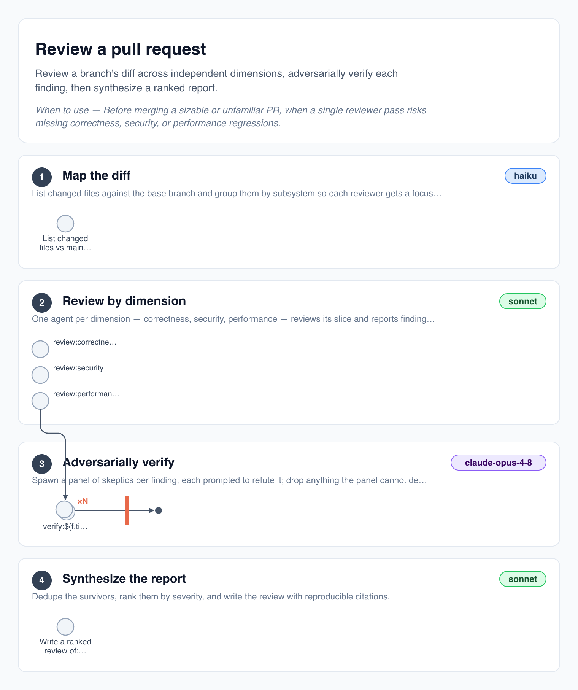

# claude-workflows-viz

Render a Claude Code **dynamic workflow** `.js` file's static structure into a clean diagram — SVG primary, PNG rasterized from it.



Dynamic workflows are JavaScript files that begin with `export const meta = { name, description, phases }` and then orchestrate subagents in the body. `claude-workflows-viz` reads the declarative `meta` block **and statically analyzes the imperative body — without ever executing the workflow** — then draws each phase as a card with its agent graph inside: fan-outs, barriers, pipelines, decision diamonds, and loop arcs. Everything is read straight off the parsed AST as static data: no `eval`, no `vm`, no `import()`, and no headless browser.

> The topology view is the default. `--view phases` renders the original meta-only phase cards (the v1 output, preserved byte-for-byte).

## Install

```sh
npm install -g claude-workflows-viz
```

Or run it without installing:

```sh
npx claude-workflows-viz <workflow.js>
```

## Usage

```
claude-workflows-viz <workflow.js> [-o <out>] [--format svg|png|html] [--view topology|phases] [--open]
```

| Option | Description |
| --- | --- |
| `-o, --out <file>` | Write the diagram to this path. Omit it and SVG/HTML stream to **stdout**. |
| `--format <fmt>` | `svg` (default), `png`, or `html`. Inferred from `--out`'s extension when omitted. |
| `--view <view>` | `topology` (default) draws the agent graph inferred from the body; `phases` renders the v1 meta-only phase cards. |
| `--open` | Open the rendered output in your default app after writing. |
| `-v, --version` | Print the version. |

### Examples

Point it at your own workflow file:

```sh
# SVG to stdout (composable)
claude-workflows-viz your-workflow.js > diagram.svg

# SVG to a file
claude-workflows-viz your-workflow.js -o diagram.svg

# PNG — format inferred from the .png extension
claude-workflows-viz your-workflow.js -o diagram.png

# Render a PNG and open it immediately
claude-workflows-viz your-workflow.js --format png --open
```

A sample workflow ships with the package. From a clone of this repo:

```sh
claude-workflows-viz examples/review-pr.js --open
```

After a global install, reference it where npm placed it:

```sh
claude-workflows-viz "$(npm root -g)/claude-workflows-viz/examples/review-pr.js" --open
```

Each phase badge is colored by its `model`: opus, sonnet, and haiku each get a swatch — matched even inside a full id like `claude-opus-4-8` — and any other model falls back to a neutral badge. Agent circles inside the graph are colored the same way.

## Example gallery

The eight bundled workflows cover the common orchestration patterns; each links to its committed renders.

| Workflow | Pattern | Render |
| --- | --- | --- |
| [`review-pr.js`](examples/review-pr.js) | review pipeline — staged lanes, no inter-stage barrier (the hero above) | [SVG](examples/review-pr.svg) · [PNG](examples/review-pr.png) |
| [`triage-issue.js`](examples/triage-issue.js) | classify-and-act — a decision routes to one of several specialists | [SVG](examples/triage-issue.svg) · [PNG](examples/triage-issue.png) |
| [`summarize-codebase.js`](examples/summarize-codebase.js) | fanout-and-synthesize — ×N readers, barrier, one synthesizer | [SVG](examples/summarize-codebase.svg) · [PNG](examples/summarize-codebase.png) |
| [`verify-fix.js`](examples/verify-fix.js) | adversarial verification — named skeptic lanes converge on a barrier | [SVG](examples/verify-fix.svg) · [PNG](examples/verify-fix.png) |
| [`name-the-feature.js`](examples/name-the-feature.js) | generate-and-filter — diverse generators, one filter | [SVG](examples/name-the-feature.svg) · [PNG](examples/name-the-feature.png) |
| [`choose-approach.js`](examples/choose-approach.js) | tournament — drafts, then a pairwise-judging loop until one stands | [SVG](examples/choose-approach.svg) · [PNG](examples/choose-approach.png) |
| [`hunt-bugs.js`](examples/hunt-bugs.js) | loop-until-done — keep spawning finders until rounds come up dry | [SVG](examples/hunt-bugs.svg) · [PNG](examples/hunt-bugs.png) |
| [`dual-lineage-review.js`](examples/dual-lineage-review.js) | dual-lineage — two independent reviewer lineages, merged verdicts | [SVG](examples/dual-lineage-review.svg) · [PNG](examples/dual-lineage-review.png) |

## How it works

1. Parse the file with [acorn](https://github.com/acornjs/acorn) and locate the top-level `export const meta`.
2. Evaluate **only** that object as a static literal — every executable construct (calls, identifiers, getters, spreads, template expressions) is rejected, never run. This is what makes "never execute the workflow" hold.
3. Validate the result with [zod](https://zod.dev), lay out the cards, and emit SVG.
4. For the topology view, the body is **statically analyzed off the same AST — never executed**: `agent()`/`workflow()` calls, `parallel()` fan-outs and barriers, `pipeline()` stages, loops, and branches become a flat graph laid out inside each phase card. The analysis never invents what it can't prove: counts come only from literals (an unresolvable fan-out renders as `×N`), condition labels are verbatim source slices, unrecognized orchestration degrades to an honest opaque step, and a phase with nothing recovered falls back to the plain v1 card — a file whose whole body is unrecoverable renders exactly the v1 page.
5. For `--format png`, rasterize the SVG with [`@resvg/resvg-js`](https://www.npmjs.com/package/@resvg/resvg-js) — a native renderer, no browser.

## From source

```sh
npm install
npm run build      # bundles ts/cli.ts -> dist/cli.js
npm test
node dist/cli.js examples/review-pr.js -o review.svg
```

## Status

v2. Renders the body's statically-inferred agent topology by default (`--view phases` keeps the v1 meta-only cards, byte-identical). The layout is a small hand-rolled banded engine — no dagre/elk dependency; adopting one stays on the roadmap, as does a trace mode that renders an *actual* run from its `agent-*.jsonl` journal.
