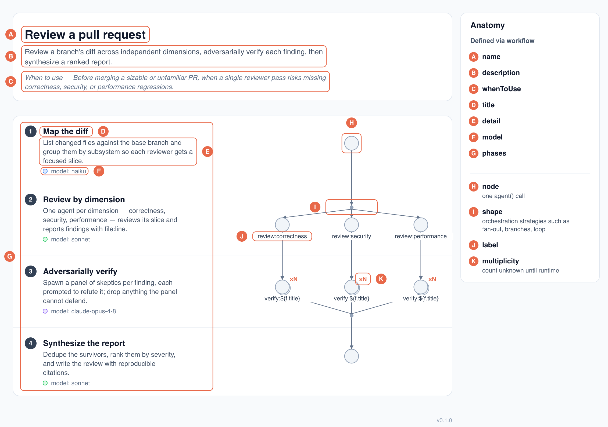

The following is 100% written by a human.

> claude-workflows-viz is a Node CLI that converts a Claude Code workflow .js file into a diagram with execution steps and agent topology.



## Install

```sh
npm install -g claude-workflows-viz

# run it without installing
npx claude-workflows-viz <workflow.js>
```

## Dynamic workflows - Introduction

Dynamic workflows was introduced by Anthropic in May this year as a way to launch multiple agents in a structured, yet dynamic way. It is structured because unlike [Agent Teams](https://code.claude.com/docs/en/agent-teams), the harness is defined in JavaScript. It is also dynamic, because the file only defines the topology and the execution steps, and delegates implementation details to the main agent. Dynamic workflows are clearly in the direction of the "thin harness" movement, but it also introduced a minimalistic way to define the structure of the harness. Overall it is quite clever, and I encourage you to read the official [docs](https://code.claude.com/docs/en/workflows) and blog [post](https://claude.com/blog/a-harness-for-every-task-dynamic-workflows-in-claude-code) if you haven't already done so.

## Dynamic workflows - Need for visualization

Dynamic workflows inherently have a graph formulation within, because it involves multiple agents working together. You can see this in the Claude blog where they visualize the workflow [patterns](https://claude.com/blog/a-harness-for-every-task-dynamic-workflows-in-claude-code), and also in the Bun [blog post](https://bun.com/blog/bun-in-rust) where they visualize via animation. If you work with dynamic workflows, it becomes immediately clear that a visual representation is needed.

## Dynamic Workflows - Under the hood

So what is inside a workflow file? As we will later discuss in more detail, there is no formal spec for dynamic workflows, so all of this may change in the future. But as of now, we have the next best thing, which is the [workflow tool description prompt](spec/upstream/2026-06-23-cc-2.1.173/workflow-tool-description.txt) that is provided to the main agent when executing workflow files. This is the plain text embedded inside the Claude Code binary (found by Claude Code). It is 159 lines and quite readable.

Claude Code also ships `sdk-tools.d.ts` next to the binary, and it contains the published type contract for WorkflowInput and WorkflowOutput.

Together with the prompt and the type contract, we have enough information to design a program that parses the workflow file into execution units and an agent topology graph.

## Implementation - No LLM, static analysis only

There were two hard requirements of the project:
1. Just compose the program with an AST parser and not rely on the LLM with a "skill"
2. Don't execute the workflow file

The result is we use [Acorn](https://github.com/acornjs/acorn) to parse the file, and use the keywords such as `agent()`/`workflow()` calls, `parallel()` fan-outs and barriers, `pipeline()` stages, loops, and branches to build a vertical graph. There are some elements that are runtime-decided, such as the labels, and the conditional logic, and in such cases it is written as is to preserve correctness.

Side note: I didn't put much thought into the style and relied on the default agent design skills, and if the project is used by other people it may be useful to add a way to inject different styles into the rendering.

## Implementation - Locking in the spec via versioning

Using the plaintext prompt in the Claude Code binary, and the published type contract, we can create our own "version", and check if the captured spec is stale by checking the hash value of the two files. This is necessary if we want claude-workflows-viz to support multiple Claude Code versions that carry different dynamic workflow implementations.

## Usage

Check **[docs/usage.md](docs/usage.md)** for the manual.

By default the workflow files are either saved in `.claude/workflows` or `~/.claude/workflows`. The visual diagram can be used in PRs when adding a dynamic workflow to the repo, or in more public settings. Personally I think this can be useful when sharing dynamic workflows in gists.

## Examples

Check the **[example gallery](examples/README.md)** for various examples.
